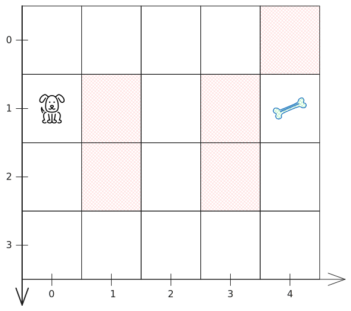
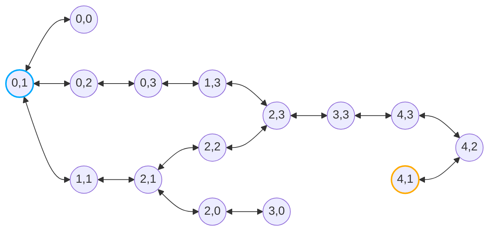

# Algorithms and Data Structures - Graphs Traversal

## Demos

### From Matrix to Graph

**Problem**

Given a matrix, we will traverse it with graph traversal techniques to find the target element.

**Movements Graph**

**Notes**
- The position start is at (0,1) where the cell has the value 'S'
- The target position is at (4,1) where the cell has the value 'E'
- The cells with the value 'X' are blocked cells

**Traversal**
- [Matrix - BFS (Breadth-First Search) Traversal](./src/matrix_bfs.py)
- [Matrix - DFS (Depth-First Search) Traversal](./src/matrix_dfs.py)

## References
- [Other Algorithms & Data Structures](https://github.com/NelsonBN/algorithms-data-structures)
